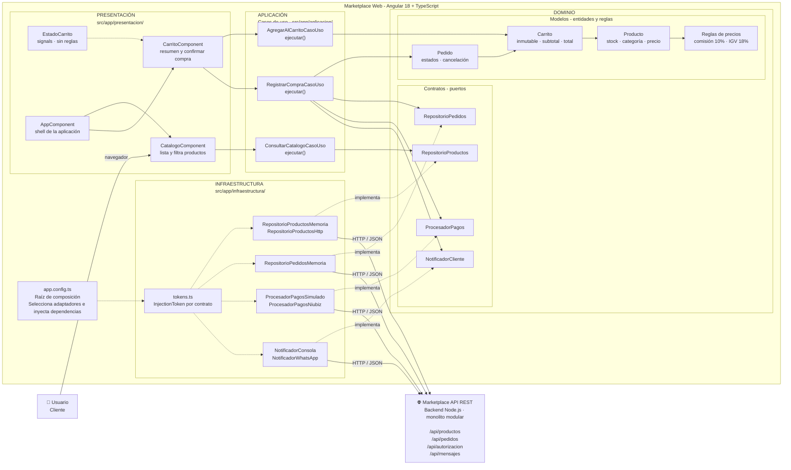
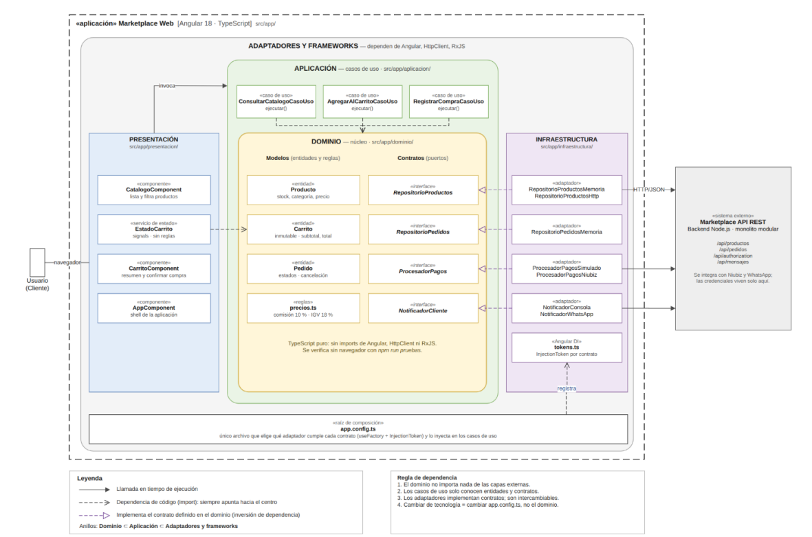

## Diagrama de Clean Architecture

### Regla de dependencia

1. El **dominio no importa nada de las capas externas**.
2. Los casos de uso solo conocen **entidades y contratos**.
3. Los adaptadores implementan contratos definidos en el dominio.
4. Cambiar de tecnología implica modificar la infraestructura o `app.config.ts`, no el dominio.

