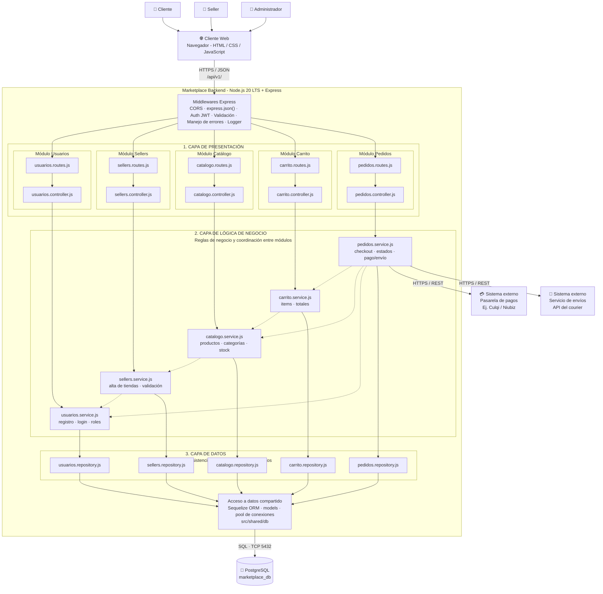

## Diagrama del Estilo Arquitectónico

### Reglas de la arquitectura

1. Cada capa solo invoca a la capa inmediatamente inferior.
2. Un módulo no accede al repositorio ni a las tablas de otro módulo.
3. La comunicación entre módulos se realiza llamando a sus servicios.
4. Todo el sistema funciona como un único proceso Node.js con una única base de datos.

